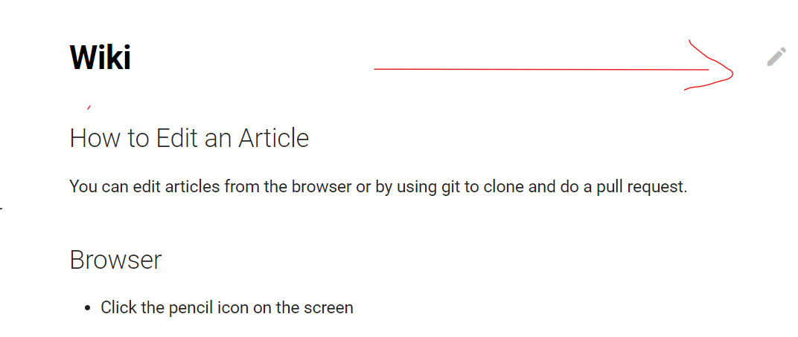

## How to Edit an Article

You can edit articles from the browser or by using git to clone and do a pull request.

## Browser

* Click the pencil icon on the screen

* Make your changes

* Submit your changes

## Git

* Go to [https://github.com/Sabayon/wiki-next](https://github.com/Sabayon/wiki-next) and click the Fork button at top left of the screen and create your own fork.
* Make the changes needed in your local fork
* Do a Pull Request

If you are new to using git, you can start looking at some [great guides](https://guides.github.com/activities/hello-world/)

## How to Add and New Page

* You will need to Fork the repo 
* You will create a new .md file
* Follow this [page for a guide](https://www.mkdocs.org/user-guide/writing-your-docs/#file-layout)
* Don't forget to update the mkdocs.yml file to reflect your new page, if you don't, nobody can see the new page
* Do a Pull Request when done
